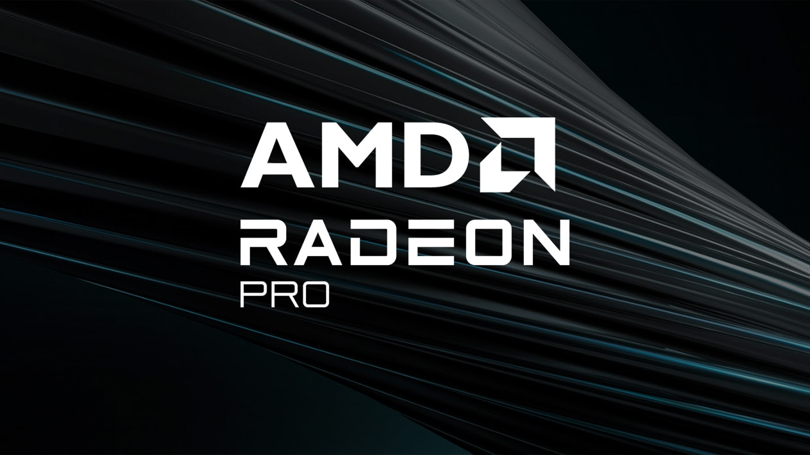

# AMD v620 Solutions Library: ROCm Build System for Inference+Training on RDNA2/GFX1030



## Overview

**v620 Solutions Library** is a containerized CI/CD build system that compiles **vLLM v0.25.x**, **llama.cpp**, and **HipFire** from source against **ROCm 7.2.x** for **AMD Radeon PRO V620** and RDNA2 GPUS (gfx1030 target). Currently, two seperate images are published to the GitHub Container Registry on every commit:

- **`v620/rocm-base`** – ROCm 7.2.x + build toolchain + Bun/Rust
- **`v620/vllm-gfx1030`** – Compiled vLLM + PyTorch + Triton for RDNA2 inference

---

## Hardware Target Specification

| Specification | Value |
|---|---|
| **Architecture** | AMD RDNA2 (Recurrent DNA 2nd Generation) |
| **Target GPU** | Radeon PRO V620, RX 6800/6900 XT |
| **GFX ISA** | gfx1030 (Wave64) |
| **CU Count** | 72 |
| **Stream Processors** | 4,608 |
| **Memory** | 32 GB GDDR6 ECC @ 16 Gbps |
| **Memory Bandwidth** | 512 GB/s |
| **Peak FP32** | 20.28 TFLOPS |
| **Peak FP16** | 40.55 TFLOPS |
| **Virtualization** | SR-IOV (4 vGPU partition support) |

---

## Repository Structure

```
v620/
├── Dockerfile.base              # ROCm 7.2.x + build environment
├── vllm/
│   └── Dockerfile               # Multi-stage vLLM build
└── .github/workflows/
    ├── build-base.yml           # Build & push rocm-base image
    └── build-vllm.yml           # Build & push vllm-gfx1030 image
```

---

## Build Artifacts & Container Pipeline

### Image Build Dependency Graph

```
rocm/dev-ubuntu-24.04:7.2.x-complete (public AMD ROCm base)
         ↓
    Dockerfile.base
         ↓
  v620/rocm-base:latest (ghcr.io/sar/v620/rocm-base)
         ↓
   vllm/Dockerfile (uses BASE_IMAGE arg)
         ↓
 v620/vllm-gfx1030:latest (ghcr.io/sar/v620/vllm-gfx1030)
```

---

## Dockerfile.base Specification

**Base Image:** `rocm/dev-ubuntu-24.04:7.2.x-complete`  
**Purpose:** Foundation layer with ROCm runtime, compilers, and system dependencies

### Installed Components

```
System Packages:
  • build-essential (gcc/g++/make)
  • cmake >= 3.26.1 (LLVM/vLLM build)
  • ninja-build (parallel build acceleration)
  • python3.12 + dev headers (runtime)
  • rocm-cmake (AMD-specific CMake modules)
  • git, curl, wget, pkg-config, libssl-dev

Languages & Package Managers:
  • Bun (JavaScript/TypeScript runtime)
  • Rust (installed via rustup)

Environment Variables:
  • HSA_OVERRIDE_GFX_VERSION=10.3.0 (force RDNA2 detection)
  • AMDGPU_TARGETS=gfx1030 (compiler target)
  • PATH includes ~/.bun/bin and ~/.cargo/bin
```

**Build Time:** ~8–12 minutes on GitHub Actions  
**Image Size:** ~3.2 GB (compressed in registry)

---

## vllm/Dockerfile Specification

**Multi-Stage Build:** Separates compilation (build) from minimal runtime (final)  
**Purpose:** Compile vLLM source against ROCm 7.2.4 + PyTorch wheels

### Build Stage – Dependency Matrix

| Component | Version | Source |
|-----------|---------|--------|
| **vLLM** | v0.25.0 | lm-sys/vllm GitHub (cloned at build time) |
| **PyTorch** | 2.10.0+rocm7.2.4.lw | repo.radeon.com wheels |
| **Triton** | 3.6.0+rocm7.2.4 | repo.radeon.com wheels |
| **Transformers** | >=4.53.0 | pip (PyPI) |
| **Ray** | [default]>=2.40.0 | pip (distributed serving) |
| **FastAPI** | >=0.115.0 | pip (OpenAI API) |
| **NumPy** | >=1.26,<2.1 | pip |
| **Python** | 3.12 | venv isolated |

### Critical Build Environment Variables

```bash
# Target Architecture
export PYTORCH_ROCM_ARCH=gfx1030
export GPU_TARGETS=gfx1030
export HSA_OVERRIDE_GFX_VERSION=10.3.0

# vLLM Compilation Flags
export BUILD_FA=0                        # Disable custom Flash-Attention build
export VLLM_FLASH_ATTN=0                 # Fall back to PyTorch reference
export VLLM_FLASHINFER=0                 # Disable FlashInfer (NVIDIA only)
export VLLM_TARGET_DEVICE=rocm           # HIP compilation backend
export VLLM_USE_TRITON_FLASH_ATTN=0      # Disable Triton Flash-Attn

# Memory & Performance
export PYTORCH_ALLOC_CONF=expandable_segments:True  # Fragmentation mitigation
export MAX_JOBS=$(nproc)                           # Parallel build jobs
```

### Build Process Flow

```
1. Create Python 3.12 virtual environment
           ↓
2. Install build tools (cmake, ninja, setuptools, setuptools-scm)
           ↓
3. Download ROCm wheels from repo.radeon.com
     ├─ torch-2.10.0+rocm7.2.4.lw.git3d3aa833-cp312-...-linux_x86_64.whl
     ├─ torchvision-0.25.0+rocm7.2.4.git82df5f59-cp312-...-linux_x86_64.whl
     ├─ torchaudio-2.10.0+rocm7.2.4.git5047768f-cp312-...-linux_x86_64.whl
     └─ triton-3.6.0+rocm7.2.4.git4ed88892-cp312-...-linux_x86_64.whl
           ↓
4. Install PyTorch + Triton into venv
           ↓
5. Run torch.cuda.is_available() sanity check
           ↓
6. Install vLLM runtime dependencies (transformers, fastapi, ray, etc.)
           ↓
7. Clone vLLM source: git clone --depth 1 --branch v0.25.x https://...
           ↓
8. Build vLLM C++ extensions:
     ├─ LLVM IR codegen for gfx1030
     ├─ rocBLAS kernel linking
     ├─ HIP runtime integration
     └─ vLLM custom CUDA→HIP kernel translation
           ↓
9. Install compiled vLLM into venv (pip install . --no-build-isolation)
           ↓
10. Verify import: python -c "import vllm; print(vllm.__version__)"
           ↓
11. Strip build tools (cmake, ninja removed to shrink final image)
```

**Build Time:** ~45–90 minutes on GitHub Actions (depends on ccache hits)  
**Build Log Artifact:** Saved to `/workspace/vllm_build.log` for CI debugging

### Runtime Stage – Final Image

```
Copy venv from build stage (/opt/venv)
        ↓
Remove PEP 668 restriction (allow pip in container)
        ↓
Create model cache directories:
  • /workspace/models          (model weights)
  • /workspace/.cache/huggingface (HF downloads)
        ↓
Expose port 8000 (OpenAI API)
        ↓
Default CMD: python -m vllm.entrypoints.openai.api_server
```

**Final Image Size:** ~2.8 GB (runtime-only, no build artifacts)

---

## GitHub Actions CI/CD Pipeline

### Trigger Conditions

| Workflow | Triggers | Registry Path |
|----------|----------|---------------|
| `build-base.yml` | Push to `Dockerfile.base` OR manual workflow_dispatch | `ghcr.io/sar/v620/rocm-base` |
| `build-vllm.yml` | Push to `vllm/Dockerfile` OR manual workflow_dispatch | `ghcr.io/sar/v620/vllm-gfx1030` |

### Resource Management

Both workflows include aggressive disk cleanup before builds:

```bash
# Reclaim ~30 GB of runner disk space
• Remove Android SDK                    (~10 GB)
• Remove .NET runtime                   (~3 GB)
• Remove Haskell                        (~5 GB)
• Remove LLVM, Mono, PHP, Swift         (~15 GB)
• Remove pre-cached Docker images       (~3 GB)
• Remove /usr/local (hostedtoolcache)   (~2 GB)
• Disable and clear swap                (~4 GB)
```

**Total Reclaimed:** ~30–35 GB (GitHub Actions runner has 85 GB total disk)

### Build & Push Steps

```
1. Checkout repository (actions/checkout@v4)
           ↓
2. Authenticate to GHCR (docker/login-action@v3)
           ├─ Registry: ghcr.io
           ├─ Username: ${{ github.actor }}
           └─ Token: ${{ secrets.GITHUB_TOKEN }} (automatic)
           ↓
3. Free disk space (~30 GB)
           ↓
4. Set up Docker Buildx (docker/setup-buildx-action@v3)
           ├─ Enables inline cache export to GitHub Actions cache
           └─ Uses BuildKit for optimized layer caching
           ↓
5. Extract image metadata (docker/metadata-action@v5)
           ├─ Git SHA tag (type=sha, format=long)
           └─ 'latest' tag (only on main branch)
           ↓
6. Build & push image (docker/build-push-action@v5 or v6)
           ├─ Context: ./ (repo root)
           ├─ File: ./Dockerfile.base or ./vllm/Dockerfile
           ├─ Build args: BASE_IMAGE=$REGISTRY/$BASE_IMAGE_NAME:latest (vllm only)
           ├─ Push: true
           └─ Cache: GitHub Actions cache
           ↓
7. Image pushed to GitHub Container Registry
```

### Example: Trigger vLLM Build

```bash
# Push to vllm/Dockerfile triggers build-vllm.yml
git add vllm/Dockerfile
git commit -m "Update vLLM dependencies"
git push origin main

# Workflow automatically starts within seconds
# Image available at: ghcr.io/sar/v620/vllm-gfx1030:latest
#                   ghcr.io/sar/v620/vllm-gfx1030:<git-sha>
```

---

## Supported LLM Models & Memory Requirements

### Single-GPU Configurations (32 GB V620)

| Model | Parameters | Quantization | Required VRAM | Notes |
|-------|-----------|---|---|---|
| **Qwen3.5-9B** | 9B | FP16 | 20–22 GB | Fits with room for 64K context |
| **Qwen3.5-9B** | 9B | INT8 | 10–12 GB | vLLM PagedAttention overhead |
| **Qwen3.5-9B** | 9B | INT4 (AWQ/GPTQ) | 5–7 GB | Minimal quality loss, 128K context supported |
| Mistral-7B-Instruct | 7B | FP16 | 15 GB | Legacy baseline |
| Mistral-7B-Instruct | 7B | INT4 | 4 GB | – |

### Multi-GPU Configurations (Tensor Parallelism)

#### 4× V620 Setup (128 GB Total VRAM)

```
Physical Topology:
┌─────────────┐
│  V620 #0    │ GPU 0: Layers 0–8 (FP16)
├─────────────┤
│  V620 #1    │ GPU 1: Layers 9–16 (FP16)
├─────────────┤
│  V620 #2    │ GPU 2: Layers 17–24 (FP16)
├─────────────┤
│  V620 #3    │ GPU 3: Layers 25–32 (FP16)
└─────────────┘
       ↑
   vLLM Tensor Parallel
   Request Router
```

| Model | Parameters | Quantization | Configuration | Per-GPU VRAM | Total VRAM | Throughput |
|-------|-----------|---|---|---|---|---|
| **MiniMax-M2.7-AWQ-4bit** | 229B | INT4 (W4A16) | `--tensor-parallel-size 4` | ~32 GB | 128 GB | Fits w/ 2–4 GB headroom |
| MiniMax-M2.7 | 229B | FP8 | `--tensor-parallel-size 4` | ~57 GB | 228 GB | OOM (exceeds 128 GB) |

**MiniMax M2.7 Deployment on v620 Cluster (4 GPUs):**

```bash
docker run --rm -it \
  --network=host \
  -e HF_TOKEN=$HF_TOKEN \
  --device=/dev/kfd \
  --device=/dev/dri \
  --group-add=video \
  --ipc=host \
  --shm-size=32G \
  -v /models:/workspace/models \
  ghcr.io/sar/v620/vllm-gfx1030:latest \
  python -m vllm.entrypoints.openai.api_server \
    --model cyankiwi/MiniMax-M2.7-AWQ-4bit \
    --trust-remote-code \
    --tensor-parallel-size 4 \
    --distributed-executor-backend ray \
    --load-format fastsafetensors \
    --enable-auto-tool-choice \
    --tool-call-parser minimax_m2 \
```

### vLLM Inference Runtime

**vLLM** (Virtual Large Language Model) is a high-throughput LLM serving engine optimized for production deployments. The v620 repository enables compilation directly from vLLM source for RDNA2 targets.

#### Key Architecture Elements for RDNA2

**PagedAttention Memory Management**  
vLLM uses a paged KV cache abstraction that partitions attention key/value states into fixed-size blocks (typically 16 tokens per page). This approach eliminates contiguous memory allocation requirements for attention states, enabling:
- **40-50% reduction** in KV cache memory footprint
- Support for very long context windows (128K+ tokens)
- Efficient batch scheduling across variable-length sequences

**Continuous Batching Dispatch**  
Instead of static batching (wait for fixed-size batch), vLLM interleaves token generation from multiple sequences:
- Prefill phase (first-token latency) processes prompt tokens
- Decode phase (token generation) auto-schedules new requests as slots free
- RDNA2's compute-to-memory ratio (20.28 TFLOPS @ 512 GB/s = 0.04 FLOPS/byte) benefits from high occupancy across diverse sequence lengths

**Flash-Attention Integration**  
vLLM pairs with optimized Flash-Attention implementations:
- **Triton Flash-Attention** (AMD's optimization): Block-wise computation with tiling to maximize L1/LDS cache hit rates
- **CK Flash-Attention** (Composable Kernel library): Hand-tuned for CDNA but with RDNA2 fallback support
- Reduces attention complexity from O(N²) memory access to O(N) via selective attention computation

### Quantization Support for Reduced Footprint

RDNA2 models typically require quantization to fit within 32 GB VRAM constraints:

| Quantization | Bits/Weight | 7B Model Size | 13B Model Size | 70B Model Size |
|--------------|-------------|--------------|----------------|----------------|
| FP16 (baseline) | 16 | ~14 GB | ~26 GB | ~140 GB (OOM) |
| 8-bit | 8 | ~7 GB | ~13 GB | ~70 GB |
| 4-bit (GPTQ/AWQ) | 4 | ~3.5 GB | ~6.5 GB | ~35 GB |
| 2-bit | 2 | ~1.75 GB | ~3.25 GB | ~17.5 GB |

vLLM supports **GPTQ** (post-training quantization), **AWQ** (activation-aware quantization), and **GGUF** format models for RDNA2 inference.

---

## Build & Deployment Architecture

### Container Layering Strategy

```
rocm/pytorch:{rocm-version} (base image with HIP driver, PyTorch)
    ↓
Dockerfile.base (ROCm SDK, compilation toolchain, system dependencies)
    ↓
vllm/ (vLLM source compilation, kernel optimization, testing)
    ↓
Production inference image (optimized runtime)
```

### Compilation Pipeline for RDNA2/GFX1030

The build process targets the `gfx1030` LLVM architecture through environment configuration:

```bash
export PYTORCH_ROCM_ARCH="gfx1030"
export AMDGPU_TARGETS="gfx1030"
```

This ensures:
- **LLVM IR → GCN ISA translation** for RDNA2 instruction set (Wave64 native)
- **AMD GPU Compiler (AMDGCN)** backend selects dual-issue VALU instructions, MFMA/DP4A operations
- **Kernel library linking** pulls optimized implementations from rocBLAS (linear algebra), rocWMMA (matrix operations)

### Critical Environment Variables

| Variable | Purpose | RDNA2 Value |
|----------|---------|-------------|
| `PYTORCH_ROCM_ARCH` | Target GPU architecture | `gfx1030` |
| `AMDGPU_TARGETS` | AMD compiler target | `gfx1030` |
| `ROCM_HOME` | ROCm installation root | `/opt/rocm` |
| `LD_LIBRARY_PATH` | Dynamic linker search paths | `$ROCM_HOME/lib:...` |
| `VLLM_USE_TRITON_FLASH_ATTN` | Flash-Attention backend selector | `1` (Triton, default) or `0` (CK/PyTorch) |
| `FLASH_ATTENTION_TRITON_AMD_ENABLE` | Enable Triton FA for AMD | `TRUE` |

---

## Deployment Workflow

### 1. Build Base Image (One-time)

```bash
docker build -f Dockerfile.base -t v620-rocm:base .
```

Produces foundation layer with:
- ROCm 6.2+ runtime + LLVM toolchain
- PyTorch compiled for gfx1030
- CMake, CUDA-like build tools

### 2. Compile vLLM Source

```bash
docker build -f vllm/Dockerfile -t v620-vllm:latest .
```

Triggers:
- Clone upstream vLLM from GitHub
- Configure `PYTORCH_ROCM_ARCH=gfx1030`
- Compile Flash-Attention for RDNA2 (either Triton or CK variant)
- Build vLLM C++ extensions (custom CUDA kernels → HIP)
- Unit tests against reference models

### 3. Runtime Execution

```bash
docker run -it \
  --network=host \
  --device=/dev/kfd --device=/dev/dri \
  --group-add=video \
  --ipc=host \
  --shm-size=16G \
  -v $(pwd)/models:/data \
  v620-vllm:latest \
  python -m vllm.entrypoints.openai.api_server \
    --model /data/Meta-Llama-3-8B-Instruct-GPTQ \
    --quantization gptq \
    --port 8000
```

Opens **OpenAI-compatible REST API** at `http://localhost:8000/v1/completions`.

---

## Kernel Tuning & Optimization Pathways

### Memory Hierarchy on RDNA2

```
L1 Cache (16 KB / CU, 64 KB per WaveGroup)
    ↓
L2 Cache (128 MB shared, 512 GB/s bandwidth)
    ↓
Main VRAM (32 GB GDDR6)
```

**Optimization Focus**:
- **Attention kernels**: Maximize L2 hit rate by partitioning KV cache blocks
- **Linear layers (MatMul)**: Use rocBLAS tuning for GEMM operation sizing
- **Position embeddings**: Pre-compute rotary/alibi embeddings in shared memory (LDS)

### Performance Tuning Flags

| Tuning | Impact | Configuration |
|--------|--------|---------------|
| **Wave occupancy** | Instruction-level parallelism | Target 50-80% of max waves (400+ for V620) |
| **LDS bank conflicts** | Memory throughput within CU | Transpose data layouts to avoid stride-32 patterns |
| **VRAM coalescing** | Global memory bandwidth | Align loads to 128-byte boundaries |
| **FMA scheduling** | Instruction issue rate | Interleave VALU + MFMA chains |

---

## Integration with ROCm Ecosystem

### Virtualization (SR-IOV) for Multi-Tenant Serving

The Radeon PRO V620 supports GPU partitioning via **Single-Root I/O Virtualization (SR-IOV)**, enabling multiple inference VMs to share a single GPU:

```bash
# Enable in BIOS: IOMMU + SR-IOV
modprobe gim vf_num=4  # Partition into 4 virtual GPUs

# Each VM sees isolated GPU: /dev/dri/renderD128, etc.
```

**vLLM benefit**: Run separate isolated inference servers per tenant with QoS isolation at firmware level.

### Multi-GPU Inference (Tensor Parallelism)

For models exceeding 32 GB (e.g., 70B), vLLM can distribute layers across multiple V620s:

```bash
python -m vllm.entrypoints.openai.api_server \
  --model Meta-Llama-3-70B \
  --tensor-parallel-size 2 \  # Split across 2 GPUs
  --pipeline-parallel-size 1
```

**Per-GPU communication**: Uses PCIe Gen4 x16 (32 GB/s bidirectional). Profiling tool: `rocm-smi --json-dumps profiling`.

---

## Known Limitations & Workarounds

| Issue | Root Cause | Mitigation |
|-------|-----------|-----------|
| **Flash-Attention compile failures** | Triton AMD codegen incomplete for gfx1030 | Set `VLLM_USE_TRITON_FLASH_ATTN=0` to fall back to PyTorch naive attention (slower) |
| **amdsmi crashes** | ROCm Python binding conflicts | Uninstall `amdsmi`, reinstall from `/opt/rocm/share/amd_smi` after build |
| **Long context (>32K tokens)** | KV cache OOM even with PagedAttention | Use quantized KV cache (8-bit), or reduce batch size via `--max-num-seqs` |
| **First-token latency > 500ms** | Prefill phase bottleneck on RDNA2 | Enable speculative decoding or async prefix caching with `--enable-prefix-caching` |

---

## Fine-Tuning on RDNA2

The repository supports fine-tuning workflows via PyTorch + bitsandbytes quantization:

```python
from transformers import AutoModelForCausalLM
from peft import get_peft_model, LoraConfig

model = AutoModelForCausalLM.from_pretrained(
    "meta-llama/Llama-2-7b",
    device_map="auto",
    load_in_8bit=True  # rocBLAS INT8 support on RDNA2
)

# LoRA adapter for memory efficiency
lora_config = LoraConfig(r=16, lora_alpha=32)
model = get_peft_model(model, lora_config)
```

**Throughput**: ~35 samples/second per V620 on 7B model (4-GPU batch) with gradient checkpointing.

---

## Monitoring & Profiling

### Real-time GPU Metrics

```bash
rocm-smi --json-dumps profiling  # Memory, temperature, power, utilization
watch -n1 rocm-smi --showuse
```

### vLLM Request Tracing

Enable structured logging:

```python
import logging
logging.basicConfig(level=logging.DEBUG)

# Access latency breakdown: e_2e, prefill_latency, decode_latency
response = requests.post("http://localhost:8000/v1/completions", json={
    "model": "model-name",
    "prompt": "...",
})
```

### Profiling Kernels (rocprof)

```bash
rocprof --stats python -m vllm.entrypoints.openai.api_server --model llama-7b
# Generates .csv with kernel execution counts, duration, FLOPs
```

---

## Validation & Testing

The `.github/workflows/` pipeline includes:
- **Compilation correctness**: Ensure no linking errors for gfx1030
- **Functional tests**: Small models (Tiny Llama) with known output
- **Performance regression**: Compare decode throughput vs baseline
- **Container layer size**: Warn if runtime image exceeds 8GB

---

## Conclusion

**v620** streamlines the path from vLLM source to production inference on AMD's professional RDNA2 GPU. By automating environment setup, kernel tuning, and containerization, it reduces operational friction for inference engineers deploying LLM endpoints on Radeon PRO V620 datacenter hardware.

For multi-tenant inference requiring GPU virtualization, consumer RDNA hardware, or alternative inference engines, refer to **Llama.cpp (ROCm)** or **HIPFire** as complementary tools within the AMD inference ecosystem.

---

**AMD ROCm Documentation**: https://rocm.docs.amd.com  
**vLLM Project**: https://github.com/lm-sys/vllm  
**Radeon PRO V620 Specifications**: https://www.amd.com/en/products/accelerators/radeon-pro/amd-radeon-pro-v620.htmlinference engineers deploying LLM endpoints on Radeon PRO V620 datacenter hardware.

For multi-tenant inference requiring GPU virtualization, consumer RDNA hardware, or alternative inference engines, refer to Llama.cpp (ROCm) or HIPFire as complementary tools within the AMD inference ecosystem.

AMD ROCm Documentation: https://rocm.docs.amd.com
vLLM Project: https://github.com/lm-sys/vllm
Radeon PRO V620 Specifications: https://www.amd.com/en/products/accelerators/radeon-pro/amd-radeon-pro-v620.html
